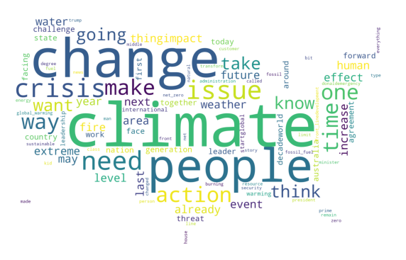

<h1 align="center" header="H1">
    Please, Act! 
</h1>

<h2 align="center" header="H1"> Politicians Lie Everytime About Subjects on the Environment, Acknowledge Climate Transformation ! </h2>
## Applied Data Analysis - CS 401 - EPFL

## Abstract

    Now more than ever, <b>climate change</b> is a very hotly debated topic which often comes up in the news. This year alone, the Intergovernmental Panel on Climate Change and World Meteorological Organization released very <b>alarming reports</b> stating that we are "way behind" on the objectives of the Paris Agreement. While there will be some individual action involved if we are to tackle the climate crisis, laws and regulations passed by governments will be imperative to avoid the worst case scenario. Using the <b>Quotebank dataset</b>, we were interested to see whether climate change is used as a <b>campaign promise by politicians</b> or if it really is a <b>subject that is constantly talked about</b>. Furthermore, which political groups are the most involved in proposing solutions and spreading awareness about the pressing climate crisis that we are facing. More importantly : do they Act?

## Our Goals 

    Using Quotebank, WikiData, allong with the Environmental indicators for USA dataset, our study aims at giving an answer to the following interogations :

<ul>
<li> Who speaks the most about climate change ? </li>
<li> What is their position on the subject ? </li>
<li> Do politicians all have the same words and opinions on the subject ? </li>
<li> What factors affect this position ? </li>
<li> What are the periods when the subject is most highlighted, and at the heart of the debates ? </li>
<li> Do voting periods have an impact ? </li>
<li> Does speaking about the problem mean taking action ? </li>
</ul>

    The first part of our study was to retrieve for the Quotebank dataset the quotes related to climate-change from 2015 and 2020. Then, we tackled the problem

 

## Section 1

    

    



## Section 2

    Then, we focused on performing an LDA (Latent Dirichlet Allocation) on the dataset, with the aim of extracting the main topics, but especially in order to be able to distribute each document as belonging to a topic. The goal of this section is to highlight the differences in lexicon used by the speakers, and what these differences imply from the opinions of each speaker on climate change.  
   After running a cross validation on the numbeer of topics, we stood with the solution having the maximum choerence number : 8 topics (à redire). For each topic, we propose a list of the most significant and meaningful terms, and a title that encompasses and interprets the topic.  

<table class="demo">
	<caption>Tableau 1</caption>
	<thead>
	<tr>
		<th>Topic 1 : General Climate Change</th>
		<th>Topic 2 : Business and Economy</th>
		<th>Topic 3 : Scientifical Knowledge and Belief</th>
		<th>Topic 4 : Concrete Impact of Climate change on the Earth and Biodiversity</th>
	</tr>
	</thead>
	<tbody>
	<tr>
		<td><ul><li>Climate</li>
			 <li>Change</li>
			<li>Crisis</li>
			<li>Challenge</li>
			<li>Action</li>
			<li>Future</li>
			<li>Important</li></ul></td>
		<td><ul><li>New</li>
			 <li>Energy</li>
			<li>Work</li>
			<li>Business</li>
			<li>Plan</li>
			<li>Opportunity</li>
			<li>Technology</li>
			<li>Forward</li>
			<li>Solution</li>
			<li>Company</li></ul></td>
		<td><ul><li>Trump</li>
			 <li>Would</li>
			<li>Question</li>
			<li>Science</li>
			<li>Scientist</li>
			<li>Made</li>
			<li>Debate</li>
			<li>View</li></ul></td>
		
		<td><ul><li>Threat</li>
			 <li>Existential</li>
			<li>Extreme</li>
			<li>Weather</li>
			<li>Increasing</li>
			<li>Drought</li>
			<li>Disaster</li>
			<li>Ocean</li>
			<li>High</li>
			<li>Biodiversity</li>
			<li>Vulnerable</li></ul></td>
	</tr>

	</tbody>
</table>



