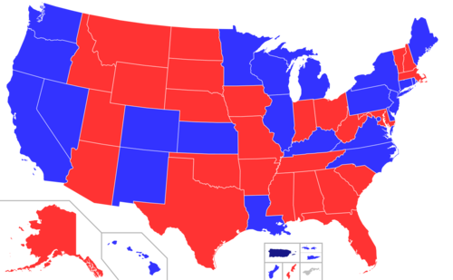
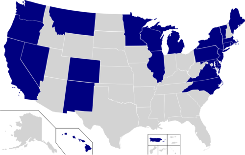

<head>
	<link type="text/css" rel="stylesheet" href="stylesheets/main.css" />
</head>

<h2 align="center" header="H1"> Politicians Lie Everytime About Subjects on the Environment, Acknowledge Climate Transformation ! </h2>
 

 
## Abstract

    Now more than ever, <b>climate change</b> is a very hotly debated topic which often comes up in the news. This year alone, the Intergovernmental Panel on Climate Change and World Meteorological Organization released very <b>alarming reports</b> stating that we are "way behind" on the objectives of the Paris Agreement. While there will be some individual action involved if we are to tackle the climate crisis, laws and regulations passed by governments will be imperative to avoid the worst case scenario. Using the <b>Quotebank dataset</b>, we were interested to see whether climate change is used as a <b>campaign promise by politicians</b> or if it really is a <b>subject that is constantly talked about</b>. Furthermore, which political groups are the most involved in proposing solutions and spreading awareness about the pressing climate crisis that we are facing. More importantly : do they Act?

## Our Goals 

    Using Quotebank, WikiData, allong with the Environmental indicators for USA dataset, our study aims at giving an answer to the following interogations :

<ul>
	<li> What are the periods when the subject is most highlighted, and at the heart of the debates ? </li>
	<li> Do voting periods have an impact ? </li>
	<li> Who speaks the most about climate change ? </li>
	<li> What is their position on the subject ? </li>
	<li> Do politicians all have the same words and opinions on the subject ? </li>
	<li> What factors affect this position ? </li>
	<li> Does speaking about the problem mean taking action ? </li>
</ul>

    The first part of our study was to retrieve for the Quotebank dataset the quotes related to climate-change from 2015 and 2020. Then, we tackled the problem by giving an answer to each of our questions in three sections :

<h3 style="text-indent: 2em;"><a href="#section1"> I. Temporal Analysis </a> </h3>
<h3 style="text-indent: 2em;"><a href="#section2"> II. Semantique Analysis</a> </h3>
<h3 style="text-indent: 2em;"><a href="#section3"> III. Behavioral Analysis</a></h3>
 

  

  

	
Top Words appearing
		“Believe in the power of your own voice. The more noise you make, the more accountability you demand from your leaders, the more our world will change for the better.” - Al Gore, Former US Vice President

<h2 id="section1"> I. Temporal Analysis </h2>

With the quotes relating to climate change gathered from the Quotebank dataset, we aim to tackle our first question about climate change in politics and media outlets. Is climate change really at the heart of debate or is it just talked about when big events arise and then forgotten until next catastrophe? 
We plotted the amount of quotes per week in a time series so as to visualize the evolution over time.
	

As we can see, the topic changes in popularity quite a lot. There are clear spikes in the amount of quotes, which we tried to annotate in the following graph. 

    



We separated events in three different categories. There are intergovernmental events such as the G20 or the Conference Of the Parties (COP). Usually, the COP make a bigger difference in the peak  which is to be expected as climate policies are the key point discussed in these conferences. We also annotated key political events (primaries or statements released by the US government). The biggest peak of the graph hails from this category, and relates to the withdrawal from the Paris Agreements by President Donald Trump in June of 2017. Finally, there are climate catastrophes like wildfires, or unusual temperatures. 

  

While these all cause notable spikes in media coverage, they disappear almost immediately. During COP, which usually last two weeks, there is usually a spike in interest on the second week and immediately drops off. The Amazonian Fires saw a spike in popularity in September of 2019, despite having gone on for several months already. For a single week, every media outlet was writing about how it is the utmost priority to stop these fires, and everyone made cute stories on Instagram showing the world how much they cared. Once the trend passes, we all forget until we are reminded by a greater and greater threat that immediate action must be taken. 

    

We can also note the sharp decrease in the average number of quotes starting mid February of 2020. This is probably caused by the media coverage COVID-19 got as it took over the world. As the dataset stops in April of 2020 (which is when COVID was at it’s strongest) we just see the decrease. It would be interesting to see if we are back to the pre-COVID graph now. If we ignore 2020, it seems that the graph is trending upwards. This is encouraging, and we might finally be taking in the importance of what is ahead. 

 

<h2 id="section2"> II. Semantique Analysis </h2>

    Then, we focused on performing an LDA (Latent Dirichlet Allocation) on the dataset, with the aim of extracting the main topics, but especially in order to be able to distribute each document as belonging to a topic. The goal of this section is to highlight the differences in lexicon used by the speakers, and what these differences imply from the opinions of each speaker on climate change.  
   After running a cross validation on the numbeer of topics, we stood with the solution having the maximum average topic coherence : 8 topics. For each topic, we propose a list of the most significant and meaningful terms, and a title that encompasses and interprets the topic. In addition to this, for the most impacting topics, we provide a representative quote to illustrate them better. 

 

	

	
	

<h3>Topic 1 : General Climate Change</h3>

  

    <h4>Top Words</h4>
    <table>
    <tbody>
    <tr>
      <td>
        <ul>
          <li>Climate</li>
          <li>Change</li>
	  <li>Important</li>
        </ul>
      </td>
      <td>
        <ul>
          <li>Crisis</li>
          <li>Challenge</li>
	  <li>Issue</li>
        </ul>
      </td>
      <td>
        <ul>
          <li>Action</li>
          <li>Future</li>
	<li>People</li>
        </ul>
      </td>
    </tr>
    </tbody>
    </table>
  

  

  

    <h4>Top Speakers</h4>
    <ul>
      <li>Harsh Vardhan : Indian Parlementary</li>
      <li>Prakash Javadekar : Indian Politician</li>
     <li>Mohammad Saleem : Indian Doctor in Toxicology</li>
    </ul>
  

	It is the biggest cluster, it is no wonder that the leading terms in it are « climate » and « change ». We find a lot of very common verbs and nouns, so this is not the most discriminant cluster to be associated with, and is not very meaningful of the speaker’s opinion.

<h3>Topic 2 : Business and Economy</h3>

  

    <h4>Top Words</h4>
    <table>
<tbody>
<tr>
  <td>
    <ul>
      <li>New</li>
      <li>Energy</li>
      <li>Economic</li>
    </ul>
  </td>
  <td>
    <ul>
      <li>Work</li>
      <li>Company</li>
      <li>Forward</li>
    </ul>
  </td>
  <td>
    <ul>
      <li>Business</li>
      <li>Plan</li>
      <li>Opportunity</li>    
    </ul>
  </td>
</tr>
</tbody>
</table>
  

  

  

    <h4>Top Speakers</h4>
    <ul>
      <li>Donald Trump: Former President of the USA, Republican</li>
      <li>Gary Baueur : Republican, Conservative</li>
    </ul>
  

 The lexical field used in this topic is business. Out of context, it might be hard to even understand that we are talking about climate change. 
	The speakers who are represented are majority Republicans, and this shows how they deal with the subject. They’re talking about "opportunity,", and speak as businessmans dealing with an economic difficulty.
	

<h4>Representative Quote</h4>

"[ I will ] cancel the Paris climate agreement and stop all payments of the United States' tax dollars to UN global warming programs." - Donald Trump

<h3>Topic 3 : Scientifical Knowledge and Belief</h3>

  

    <h4>Top Words</h4>
    <table>
<tbody>
<tr>
  <td>
    <ul>
      <li>Trump</li>
      <li>Would</li>
	<li>Question</li>
    </ul>
  </td>
  <td>
    <ul>
      <li>Science</li>
	    <li>View</li>
	    <li>Matter</li>
    </ul>
  </td>
  <td>
    <ul>
      <li>Scientist</li>
      <li>Debate</li>
	    <li>Whether</li>
    </ul>
  </td>
</tr>
</tbody>
</table>
  

  

  

    <h4>Top Speakers</h4>
    <ul>
      <li>Scott Pruit : Republican</li>
      <li>Donald Trump : Republican, Former US President</li>
      <li>Marc Morano : Republican, Leader of a denying climate change organization</li>
    </ul>
  

	This is the subject of scientific knowledge and belief in climate change. While we find some climatologists like Will Steffen, the fact that we find so many Republicans is striking. This reflects the latent questioning about the reality of climate change within this political edge, as emphasized by the predominance of modulators such as "Would", "Question", or "Wether". Finally, the word "Trump" confirms this negationism, allong with the association with the openly denier Marc Morano.
	

<h4>Representative Quote</h4>

"Why not? Less snow used to 'prove' global warming. Snow used to be 'a thing of the past' according to climate activists. Now more snow 'proves' global warming. No matter the weather, they can claim it is consistent with global warming theory." - Marc Morano

	

<h3>Topic 4 : Concrete Impact of climate change on the Earth and Biodiversity</h3>

  

    <h4>Top Words</h4>
    <table>
<tbody>
<tr>
  <td>
    <ul>
      <li>Existential</li>
      <li>Threat</li>
      <li>High</li>
     <li>Disaster</li>
    </ul>
  </td>
  <td>
    <ul>
      <li>Water</li>
      <li>Ocean</li>
      <li>Flood</li>
	 <li>Biodiversity</li>
    </ul>
  </td>
  <td>
    <ul>
      <li>Increasing</li>
      <li>Drought</li>
      <li>Weather</li>
	<li>Vulnerable</li>
    </ul>
  </td>
</tr>
</tbody>
</table>
  

  

  

    <h4>Top Speakers</h4>
    <ul>
      <li>Catherine McKenna : Canadian Minister engaged for environment</li>
      <li>Andrew Cuomo : Democrat</li>
      <li>Gina McCarthy : Administrator of the Environmental Protection Agency</li>
    </ul>
  

	This topic discusses the concrete changes and disasters caused by climate change on the environment and biodiversity. In this sense, it could be said that it is the opposite of the previous Topic 3, which is also proved by the opposition between these two topics on both sides of the PCA2 axis. Finally, we note that the speakers most present are all Democrats.

<h4>Representative Quote</h4>

"There is no greater imperative at this time than mobilizing more private investment in clean energy deployment in communities throughout Connecticut and across this country to combat global climate change," - Gina McCarthy

<h3>Topic 5 : Air Pollution and Fossil Energy</h3>

  

    <h4>Top Words</h4>
    <table>
<tbody>
<tr>
  <td>
    <ul>
      <li>Greenhouse Gas</li>
      <li>Reduce</li>
	 <li>CO2 Emission</li>
    </ul>
  </td>
  <td>
    <ul>
	<li>Air</li>
      <li>Pollution</li>
      <li>Fuel</li>
    </ul>
  </td>
  <td>
    <ul>
      <li>Cut</li>
      <li>Waste</li>
	    <li>Carbon</li>
    </ul>
  </td>
</tr>
</tbody>
</table>
  

  

  

    <h4>Top Speakers</h4>
    <ul>
      <li>Michel Jarraud : Meteorologist</li>
      <li>Petteri Taalas: Secretary General of the World Meteorological Organization</li>
    </ul>
  

In this section, we see a lot of concern about the air quality from meteorologists. There are also words linked to the fossil energy. It is not new that most of the gas emissions are produced by fossil energy and are the principal cause of the global warming.
	

<h3>Topic 6 : International Concern and Cooperation arround Climate Change</h3>

  

    <h4>Top Words</h4>
    <table>
<tbody>
<tr>
  <td>
    <ul>
      <li>International</li>
      <li>Agreement</li>
	    <li>COP</li>
    </ul>
  </td>
  <td>
    <ul>
      <li>Young People</li>
	<li>Adaptation</li>
      <li>Agriculture</li>
    </ul>
  </td>
  <td>
    <ul>
      <li>Meeting</li>
      <li>Development</li>
	    <li>Security</li>
    </ul>
  </td>
</tr>
</tbody>
</table>
  

  

  

    <h4>Top Speakers</h4>
    <ul>
      <li>Bernie Sanders : Democrat</li>
      <li>Hilary Clinton : Democrat</li>
      <li>Scott Pruitt : Republican and Administrator of the Environmental Protection Agency</li>
    </ul>
  

Once again, the distribution of speakers in this topic is telling. There are mainly Democrats, which shows their commitment and conviction for a comprehensive and fair solution to the problem of climate change. This confirms their willingness to act and cooperate.
	

<h3>Topic 7 : Catastrophic Records</h3>

  

    <h4>Top Words</h4>
    <table>
<tbody>
<tr>
  <td>
    <ul>
      <li>Human</li>
	<li>Activity</li>
      <li>Caused</li>
	<li>Destruction</li>
    </ul>
  </td>
  <td>
    <ul>
      <li>Temperature</li>
	 <li>Global</li>
	    <li>Warming</li>
    </ul>
  </td>
  <td>
    <ul>
      <li>Earth</li>
	<li>Record</li>
      <li>Wildfire</li>
    </ul>
  </td>
</tr>
</tbody>
</table>
  

  

  

    <h4>Top Speakers</h4>
    <ul>
      <li>Andrew Wheeler : Lawyer and lobbyist in energy policies</li>
      <li>Scott Pruitt: Republican and Administrator of the Environmental Protection Agency</li>
    </ul>
  

This topic of climatological records gives the speech mainly to politicians who were in power and governed during a period in the United States.
	

<h3>Topic 8 : Axis of Hope, Democrat's group</h3>

  

    <h4>Top Words</h4>
    <table>
<tbody>
<tr>
  <td>
    <ul>
      <li>United</li>
      <li>Health Care</li>
	    <li>Sure</li>
    </ul>
  </td>
  <td>
    <ul>
      <li>Long Term</li>
      <li>Federal</li>
	  <li>Tax</li>
    </ul>
  </td>
  <td>
    <ul>
      <li>Across country</li>
	<li>Greta</li>
      <li>Combating</li>
    </ul>
  </td>
</tr>
</tbody>
</table>
  

  

  

    <h4>Top Speakers</h4>
    <ul>
      <li>Bernie Sanders : Democrat</li>
      <li>Barack Obama : Former President</li>
      <li>Jay Inslee : Democrat, Governor of Washington</li>
      <li>Al Gore : Democrat</li>
    </ul>
  

	Once again, the conclusions are clear. For the democrats who speak about climate change, we are talking about "union", "care" and "long term". There are thus unifying speeches that suggest optimism for the future. 
	

<h4>Representative Quote</h4>

"I am proud that, along with Senator Barbara Boxer, a few years ago we introduced the first piece of climate change legislation that called for a tax on carbon," - Bernie Sanders

	
 

<h3> Conclusion of this Section </h3>

	We were able to show that some topics like topic 2 and topic 3, wear a certain denialist and minimizing ideology about climate change, refuse to see reality, and may moreover deal with climate change from an economic perspective and with a business logic. Those two topics which are close on a meaningful aspect, are also found close on the LDA PCA projection graph. And as the following cast shows, we can see that this ideology is unique to the Republican Party.
	
	On the other hand, Democrats are in the strong majority in topics 4 and topic 8, which we have established as axes which affirm the concrete impact of climate change, and give a speech that is both alarming and optimistic, which calls for action.

	

	

	
	

  

<h2 id="section3"> III. Behavioral Analysis </h2>

	Finally, we aim to see where most of these quotes come from and whether these quotes translate into meaningful actions. As seen previously, most of these quotes hail from the Democratic Party, with the Republican party only representing less than a quarter of the quotes. We also saw that they use the climate change subject for different objectives, as is displayed in the bar graph below. Democrats are slightly more likely to use the word “crisis” than republicans, but the latter are far more likely to talk about business in climate related quotes. There is a clear divide in the perception and the priority with relation to climate change.
	

	

	
	

	

	

	

	
	

 

	Now, where do these quotes come from? Unsurprisingly, the most populated democrat states produce the highest number of quotes with the state of Washington being the most outspoken about the subject, and Arkansas the lowest. In order to see if climate was a bigger priority in states where it was talked about the most, we crossed these measurements with an “environment” score for each state based on their climate policies. These look pretty correlated, with states like Vermont or Colorado being at the top.
	

	<iframe name="mapiframe" id="igraph" scrolling="no" style="border:none;" seamless="seamless" src="https://chart-studio.plotly.com/~elsamusy/1.embed" height="525" width="100%"></iframe>

On the left, we can see the 2016 election results, with democrat states blue and republican ones in red. On the right, the states having entered the United State Climate Alliance are highlighted. 
 
Another way this division is showcased is through the United State Climate Alliance coalition. This coalition was created after the rescinding of the Paris agreement by President Trump, urging states to keep striving towards the goals set at the COP 21. The agreement was signed by 12 Democratic states and only 2 Republican states a couple of weeks later. Just like the Paris agreements they aren’t real regulations, but do show an interest in making a change for the better. 

  
 

	We also tried to correlate the amount of climate change related quotes with CO2 emissions of each state. There is a slight correlation (although not very big), but it probably isn’t exclusively linked to personal habits. States where the economy relies heavily on agriculture or industry are typically more republican, and these activities emit large amount of CO2 as they are very energy expensive.
	



  To try and observe this divide, we calculated the difference between the normalized CO2 emissions and amount of quotes relating to climate change per state. With the exception of a few states, Democratic states always have more quotes than they have emissions. The opposite is also true for Republican states. While this might be explained by the aforementioned explanation, it is clear that climate action is one of the dividing factors between the two political parties. 



Climate change isn't really being treated as the emergency it is in the US. While it seems that the subject is being brought to light more and more regularly, it isn't enough. The subject comes and goes as the public opinion is reminded at every wildfire, hurricane and flash flood that this is our only planet and that we have to take care of it. 
Still, not everyone agrees on the stance to take regarding climate change. Democrats tend to be more alarmed than Republicans, who seem very worried about the business aspect of things.
Concerns about climate change are not spread evenly geographically either: once again, it is the democrat states which are talking the most about it. As these states have an economy less reliant on industry and energy heavy jobs, it makes a transition towards emitting less greenhouse gases easier. But if we took into considerations where the products of the industrial states are consumed, would we still be seeing these small desolate states pollute so much? 

The only way we are going to stop climate change and commit to a 2 degree future (we already missed the train for 1.5C!) is by working together. Climate action need to be more than a partisan issue. It involves all of us as human beings living on the one and only beautiful planet Earth. 

“We are the first generation to feel the effect of climate change and the last generation who can do something about it.” - Barack Obama

